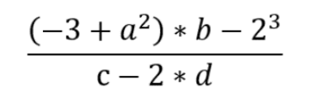
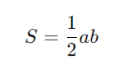

***Задание 1. Язык математики***
В первый же день на сайте отвалилась формула по расчёту рекламной
метрики, и только Вася может её поправить. Часть программы с вводными
данными представлена ниже, отдельно записана формула на математическом
языке.
Дана программа:
a = 8
b = 10
c = 12
d = 18
Продолжите программу: переведите выражение с математического языка на
язык Python, запишите его в переменную res и выведите результат.

***Задача 2. Часы***
Напишите программу, которая получает на вход число n (количество минут),
затем считает, сколько это будет в часах и сколько минут останется, и выводит
на экран эти два результата.

***Задача 3. Счастливый билет***
Вы пользуетесь общественным транспортом? Вероятно, вы расплачивались за
проезд и получали билет с номером.
Счастливым билетом называют такой билет с шестизначным номером, где
сумма первых трех цифр равна сумме последних трех.
Т.е. билет с номером 385916 – счастливый, т.к. 3+8+5=9+1+6.
Вам требуется написать программу, которая проверяет счастливость билета с
номером n и выводит на экран yes или no.

***Задача 4. Площадь прямоугольного треугольника***
Прямоугольный треугольник — это треугольник, один из углов которого
является прямым (90 градусов). У прямоугольного треугольника два катета,
которые образуют прямой угол, и гипотенуза, противоположная этому углу.
Вам требуется написать программу, которая запрашивает у пользователя
длины двух катетов и выводит площадь треугольника.
Площадь прямоугольного треугольника вычисляется по формуле:

где a и b — длины катетов, а S — площадь.

***Задача 5*. Поменять местами: не всё так просто!*** (необязательная,
повышенной сложности)
Напишите программу, которая меняла бы значения двух переменных местами,
но без использования третьей переменной и синтаксического сахара, который
мы разбирали, а именно: без конструкции a, b = b, a. В переменные будут
вводиться только числа.
a = int(input('Введите первое число: '))
b = int(input('Введите второе число: '))
print(a, b)
# стереть эту строчку и вставить свой код здесь
print(a, b)
Изменять, удалять, менять местами первую, вторую, третью и последнюю
строчки нельзя. В четвёртую строку можно вставлять сколько угодно кода, не трогая последний print.
